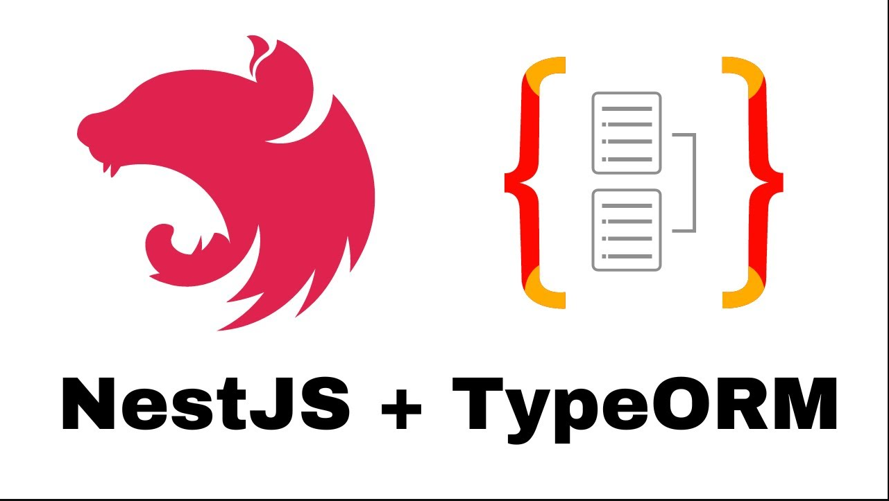

# NestJS + TypeORM Tutorial | Repositories, Relations, Migrations & More

https://www.youtube.com/watch?v=9MGKKJTwicM&ab_channel=MichaelGuay

In this video, we do a deep dive into setting up NestJS with TypeORM. We look at repositories, relations, transactions, subscriptions, migrations & unit testing.

**Project** --> Back end App/Service for item, listing, tags and comments<br>
**Channel** --> Michael Guay 13,6 mil inscritos<br>
**Date Created** --> 22 de jun. de 2023

### npm Commands

nest new nestjs-typeorm<br>
pnpm i @nestjs/typeorm typeorm mysql2<br>
pnpm i @nestjs/config<br>

created docker-compose.yml

- docker-compose up

nest g module database
nest g resource items

- module, controller, service, entities & dto
- crud

npm run typeorm:create-migation --name=PublicItems<br>
npm run typeorm:run-migrations<br>
npm run typeorm:revert-migrations<br>

```
"typeorm": "ts-node ./node_modules/typeorm/cli",
"typeorm:create-migration": "npm run typeorm -- migration:create ./migrations/$npm_config_name",
"typeorm:run-migrations": "npm run typeorm migration:run -- -d ./typeOrm.config.ts",
"typeorm:revert-migrations": "npm run typeorm migration:revert -- -d ./typeOrm.config.ts"
```

### Observations

- nest
- typeorm
- ts
- mysql2
- dotenv

### Components

- comment
- item
- listing
- tag
